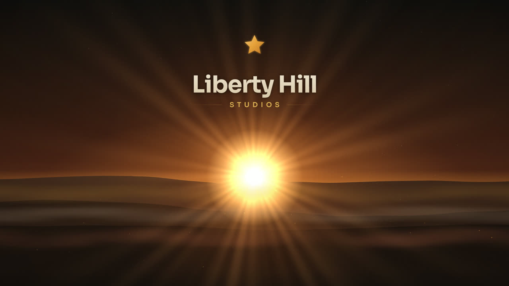
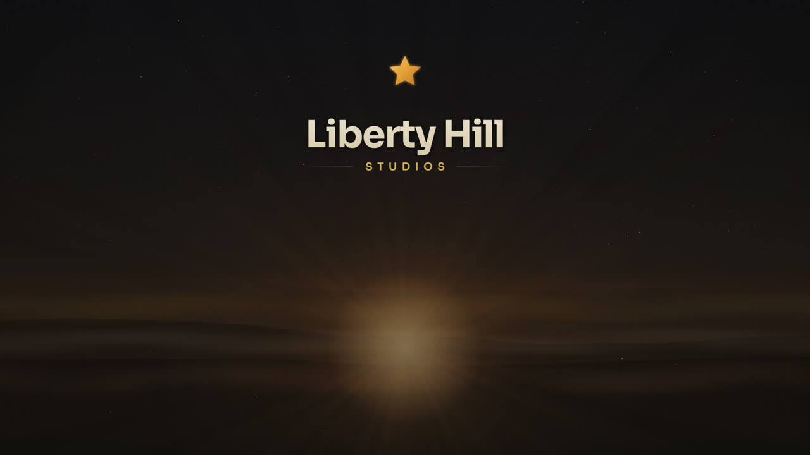
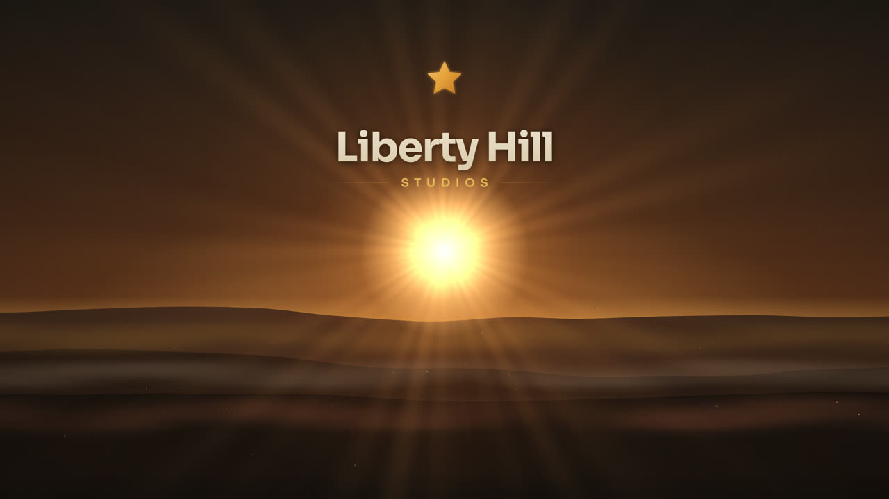

# Liberty Hill Studios — Desktop Theme

The studio's signature **Texas Hill Country dusk**, living on your desktop. A fully
animated wallpaper that follows the **real sun and the real moon** — golden afternoon →
signature dusk → near-black starry night with fireflies and the Milky Way → rose dawn —
plus a complete Windows brand kit: transparent taskbar, dark + gold accent theme,
terminal colors, notification chimes, icons, and an optional keyboard-driven
search/navigation stack.


| Dusk | Night | Day |
|---|---|---|
|  |  |  |

## Quick install

```powershell
git clone https://github.com/trimmdev/lhs-desktop-theme
cd lhs-desktop-theme
.\install.ps1              # wallpaper + taskbar + theme + terminal + chimes (opt-in)
.\install.ps1 -NavStack    # ...plus Everything, PowerToys FancyZones, Flow Launcher
```

Everything is **user-level and reversible**. One or two UAC prompts may appear for app
installers. See the end-of-install output for the three optional manual finishing touches
(avatar, gold pointer, lock screen).

## The field guide

An animated walkthrough of every feature and shortcut lives at [`docs/guide.html`](docs/guide.html) —
open it in any browser after cloning.

## What's inside

- **`wallpaper/lhs-dusk.html`** — the living wallpaper. Self-contained single file
  (Sora font embedded, zero network calls). Canvas-rendered at native resolution on any
  monitor: noise-generated ridgelines, dithered sky gradient, aerially-shaded hills,
  backlit cloud decks, god-rays, drifting valley mist, rising embers that become
  fireflies at night, a dense star field + Milky Way + shooting stars, film grain, and
  the Lone Star + wordmark lockup. 30fps capped, **~0.2% of one CPU core per monitor**
  (measured), auto-pauses under fullscreen apps (via Lively).
- **`stills/`** — pixel-perfect PNG renders at 16 standard resolutions (1366×768 → 8K,
  16:10, ultrawides, 5K, portrait) + dawn/day/night variants at common sizes. Use as
  static wallpapers or lock screens. Need another size?
  `node tools/bake-stills.mjs 7680x2160 --moods dusk,dawn`.
- **`terminal/liberty-hill-dusk.json`** — Windows Terminal scheme (ink background,
  parchment text, gold cursor, ember/verdant/sky/plum ANSI ramp).
- **`flow-launcher/Liberty Hill Dusk.xaml`** — Flow Launcher theme (translucent ink
  glass, gold caret + selection).
- **`fancyzones/`** — PowerToys FancyZones config: gold snap highlights + three studio
  layouts (*LHS Ultrawide 30-40-30*, *LHS Quad*, *LHS Halves*).
- **`icons/`** — multi-size `lhs.ico` (Lone Star mark), account avatar, OEM logo.
- **`sounds/`** — two short studio chimes (finish + attention), wired to the Windows
  sound events `SystemAsterisk`, `SystemExclamation`, and `Notification.Default`.

## The sky is computed, not faked

The scene doesn't just interpolate between times of day — it solves for where the sun
and moon actually are.

- **Sun** — altitude from the USNO/NOAA low-precision solar equations. Sunrise, golden
  hour, civil twilight and night follow the true sun for the date, so they drift with the
  seasons instead of firing at hardcoded clock times. The disc is clipped to the sky, so
  the ridge genuinely occludes it as it rises and sets.
- **Moon** — position and phase from abridged lunar theory (Meeus ch. 47, with the
  evection, variation and annual-equation terms). Verified at **0.38 minutes of error per
  lunation across 618 lunations / 50 years**. The terminator is a real projected ellipse,
  the unlit limb carries earthshine, the maria rotate with the parallactic angle, and the
  disc grows and shrinks with true perigee/apogee distance.
- **Sunrise ≠ sunset** — dawn gets its own cooler, rosier palette. Overnight the air
  settles, so morning runs violet → rose → peach where evening runs ember.
- **Late-hour comfort** — after ~22:30 the finished frame is eased down and warmed,
  deepest through the small hours, lifting before dawn.

**Set your own location** — the site is a single constant near the top of
`wallpaper/lhs-dusk.html`:

```js
const SITE = { lat: 30.6624, lon: -97.9247, name: "Liberty Hill, Texas" };
```

**One deliberate stylization:** the sun is pinned to the centre of the frame rather than
placed at its true azimuth, because the composition nests it in a dip baked into the far
ridge, under the wordmark. The moon *does* use its true azimuth. So each body's own
position is real, but the on-screen distance *between* them is not — at a first quarter
they are 97° apart in the real sky while appearing close together here.

### URL parameters

| Param | Effect |
|---|---|
| `?mood=day\|dusk\|dawn\|night` | Pin a mood instead of following the real sun |
| `?at=2026-07-21T21:30` | Run the scene at another moment (local time) |
| `?at=+9` / `?at=-3.5` | ...or a signed hour offset from now |
| `?speed=1440` | Run the clock N× faster — 1440 puts a full day in one minute, with a time/sun/moon readout |
| `?still=1` | One deterministic frame, for baking PNGs |

## Design law

Gold `#E8A13A` is an **accent, never a background**: cursors, highlights, selection,
icons — small elements only. Surfaces stay translucent ink (`#0A0807`). Standard system
affordances (drive icons, capacity bars) are never reskinned.

## The stack it rides on

[Lively Wallpaper](https://github.com/rocksdanister/lively) ·
[TranslucentTB](https://github.com/TranslucentTB/TranslucentTB) ·
[PowerToys](https://github.com/microsoft/PowerToys) ·
[Everything](https://www.voidtools.com/) ·
[Flow Launcher](https://github.com/Flow-Launcher/Flow.Launcher) — all free, all excellent.
Wordmark font: [Sora](https://fonts.google.com/specimen/Sora) (SIL Open Font License),
embedded as base64.

## Palette

| Token | Hex | | Token | Hex |
|---|---|---|---|---|
| ink-950 | `#0a0807` | | gold-400 | `#e8a13a` |
| parchment | `#f5ecd9` | | gold-300 | `#ecbe5b` |
| ember-400 | `#d4542b` | | gold-600 | `#b3661f` |

Mirrors `liberty-hill-studios/src/lib/palette.ts` — change them together or the dusk
drifts from the site.

---

Built with care at Liberty Hill Studios. 🌵⭐
